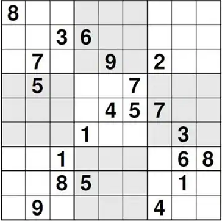

# hpuzzle

An embedded domain-specific language (eDSL) written in Haskell for modelling and solving constraint-based mathematical puzzles. Puzzle rules are modelled as comparisons between linear expressions over integer-valued variables, enabling concise yet expressive encodings of a wide range of puzzles, including Sudoku and n queens.


## Constraint-based mathematical puzzles

In many newspapers, magazines, and websites, one can find single-player puzzles with simple rules that require only logical reasoning and basic mathematical knowledge to be solved. Many of these puzzles, such as Sudoku and magic squares, have gained widespread popularity—perhaps due to their independence from natural languages and specific cultural knowledge.

Many of these puzzles can be translated into mathematical models, where a solution to the model directly corresponds to a solution to the original puzzle. Typically, such models are solved using [constraint satisfaction problems (CSPs)](https://en.wikipedia.org/wiki/Constraint_satisfaction_problem) techniques.

The aim of this project is to design and implement a domain-specific language (DSL) for describing and solving a subset of these puzzles.

### Modelling constraint-based mathematical puzzles

Analysing the rules of several of these puzzles, I noticed that they can be encoded into mathematical models such that:

- the decisions to make can be modelled as variables, each with an associated finite domain of possible values;
- the game rules can be expressed as constraints over those variables;
- a solution is a valuation of the variables (i.e. an assignment of each variable to a value in its domain) that satisfies all stated constraints.

More concretely, I noticed that in order to encode many of these puzzles, we can restrict this representation to variables ranging over integers. Furthermore, to express most of the game constraints, it is sufficient to compare linear expressions over these variables.

As defined in *Principles of Constraint Programming*[^1], a **linear expression over integer values** (from now on, simply linear expression) is the sum of a finite number of terms, where each term is either an integer constant or the product of an integer and a variable. Formally,
```
<exp> := <int> 
      |  <int> ⋅ <var> 
      |  <exp> + <exp> 
```
A **linear constraint** is a formula of the form
``` 
s op t
```
where `s` and `t` are linear expressions, and `op` is one of: `=`, `≠`, `<`, `≤`, `>`, or `≥`.

To illustrate this approach, consider this model for [Sudoku](https://en.wikipedia.org/wiki/Sudoku):
- Declare a variable for each grid cell. Its domain is either `{v}` or `{1,2,3,4,5,6,7,8,9}`, depending on whether the cell has a known value `v` or is empty.
- Constrain the values in each row, column, and 3 × 3 subgrid to be pairwise different.

These constraints can be written using linear constraints. Let `v₁`, `v₂`, ..., `v₉` be the variables for a row. Then, to ensure all values are distinct, we must enforce the following 36 linear constraints:

`v₁ ≠ v₂`, `v₁ ≠ v₃`, `v₁ ≠ v₄`, `v₁ ≠ v₅`, `v₁ ≠ v₆`, `v₁ ≠ v₇`, `v₁ ≠ v₈`, `v₁ ≠ v₉`,  
`v₂ ≠ v₃`, `v₂ ≠ v₄`, `v₂ ≠ v₅`, `v₂ ≠ v₆`, `v₂ ≠ v₇`, `v₂ ≠ v₈`, `v₂ ≠ v₉`,  
`v₃ ≠ v₄`, `v₃ ≠ v₅`, `v₃ ≠ v₆`, `v₃ ≠ v₇`, `v₃ ≠ v₈`, `v₃ ≠ v₉`,  
`v₄ ≠ v₅`, `v₄ ≠ v₆`, `v₄ ≠ v₇`, `v₄ ≠ v₈`, `v₄ ≠ v₉`,  
`v₅ ≠ v₆`, `v₅ ≠ v₇`, `v₅ ≠ v₈`, `v₅ ≠ v₉`,  
`v₆ ≠ v₇`, `v₆ ≠ v₈`, `v₆ ≠ v₉`,  
`v₇ ≠ v₈`, `v₇ ≠ v₉`,  
`v₈ ≠ v₉`


In summary, to support this approach to modelling and solving constraint-based puzzles, we need an interface that allows us to:

- create variables with finite integer domains;
- create restrictions over those variables as linear constraints; and
- compute one or more solutions that satisfy all given constraints.

This formulation enables the construction of a concise yet expressive DSL for a wide range of mathematical puzzles.


## DSL Overview

The project defines two key abstractions: linear expressions and puzzles.

### `LinearExpr` — A DSL for linear expressions over integer values

Linear expressions are modeled using the `LinearExpr` type class:

```haskell
class LinearExpr e v | e -> v where
    constant  :: Int -> e
    term      :: Int -> v -> e
    plus      :: e -> e -> e
    scale     :: Int -> e -> e
    normalise :: Ord v => e -> NormForm v
    linear    :: NormForm v -> e
    minus     :: e -> e -> e
```
The functional dependency `e -> v` ensures that the variable type `v` is uniquely determined by the expression type `e`, allowing more precise type inference.

The methods `constant`, `term`, `plus` and `scale` are the core constructors of the language. They allow you to build linear expressions from an integer value, a variable with its integer coefficient, the sum of two expressions, and the scalar product of an expression with an integer, respectively.

The `normalise` method interprets an expression by reducing it to its normal form, defined as:
```haskell
type NormForm v = ([(v, Int)], Int)
```
This form merges all occurrences of each variable into a single term, discarding those with a zero coefficient, yielding a canonical representation of the expression.

Finally, `linear` and `minus` are derived operators: `linear` is a smart constructor that builds an expression from a normal form, while `minus` represents the difference between two linear expressions.


For example, the linear expression `x + 2y - 5` can be written using the DSL as:

```haskell
minus (plus (term 1 x) (term 2 y)) (constant 5)
```

Or, equivalently, using infix operators (defined in `LinearExpr`):
```haskell
1 *. x <+> 2 *. y <-> constant 5
```

#### Implementation

For an implementation of `LinearExpr`, a deep embedding approach has been used, where expressions are represented by the algebraic datatype `LinExp`:

```haskell
data LinExpr v = Lit Int
               | Term Int v
               | Plus (LinExpr v) (LinExpr v)
```


### `Puzzle` — A Monadic Interface for Constraint-Based Puzzles

The `Puzzle` type class defines a monadic interface for modelling and solving constraint-based puzzles.

```haskell
class (Monad m, LinearExpr e v) => Puzzle m e v | m -> e where
    
    -- Variable creation
    newVar      :: [Int] -> m v
    newVars     :: Int -> [Int] -> m [v]
    
    -- Constraints
    empty       :: m ()
    setValue    :: Int -> v -> m ()
    forbidValue :: Int -> v -> m ()
    equalVars   :: v -> v -> m ()
    diffVars    :: v -> v -> m ()
    allEqual    :: [v] -> m ()
    allDiff     :: [v] -> m ()
    cmp         :: (Int -> Int -> Bool) -> e -> e -> m ()
    (.=.)       :: e -> e -> m ()
    (./=.)      :: e -> e -> m ()
    (.<.)       :: e -> e -> m ()
    (.<=.)      :: e -> e -> m ()
    (.>.)       :: e -> e -> m ()
    (.>=.)      :: e -> e -> m ()
    
    -- Solving
    oneSol      :: m [v] -> Maybe [Int]
    allSol      :: m [v] -> [[Int]]
```

The class is parameterised over:
- `m`: the monadic context in which variables are declared and constraints are added,
- `e`: the type of linear expressions,
- `v`: the type of variables.

The functional dependency `m -> e` ensures that the expression type `e` is uniquely determined by the monadic context `m`.

The methods in the class are grouped into three categories, reflecting the formulation introduced in the previous section:

- Variable creation
- Constraint creation
- Resolution

The first group includes a main method `newVar`, which creates a new variable with a given finite domain, and a derived method `newVars` to create several variables, all with the same domain.

The second group provides several constraint-building methods, but only two are required in a minimal implementation:

- `empty`, a no-op representing a trivially satisfied constraint.
- `cmp`, a generalisation of linear constraints, which imposes a relationship between two linear expressions using a binary predicate on their evaluated integer values. For example, `cmp (\x y -> y >= 2 * x) e0 e1` states that the value of `e1` must be at least twice the value of `e0`.

Note that all other methods from this group can be written using `cmp`.

The final group includes two methods, `oneSol` and `allSol`, which compute one or all solutions, respectively, for the given variables such that all constraints in the monad are satisfied.

#### Implementation

To implement a monadic class for puzzles, a shallow embedding has been adopted, using the `Control.Monad.CSP` library for constraint handling and solving.

Variables are represented by the following type:
```haskell
data Var = Var {name :: String, dv :: DV [Int] Int}
```
where:
- `name` is an internal identifier used to define a simple and safe ordering over variables;
- `dv`, from the `Control.Monad.CSP` library, encodes the variable's domain and provides an internal representation used by the CSP solver to encode and solve restrictions.

For the monadic context for variables and constraints, we use the `CSPPuzzle` monad:
```haskell
type CSPPuzzle = StateT Int (CSP [Int])
```
which stacks:
- a `StateT` layer used solely for generating fresh variable names;
- the `CSP` monad from `Control.Monad.CSP`, which maintains variable domains, enforces constraints, and performs constraint solving.

Finally, an instance of `Puzzle` is provided for `CSPPuzzle (LinExpr Var) Var`, where most methods are implemented by lifting primitives from `Control.Monad.CSP`.


## Examples

### Sudoku

Sudoku, a Japanese term meaning "single number", is a combinatorial number-placement puzzle. In its classic form, the goal is to fill a 9×9 grid with digits so that each row, each column, and each of the nine 3×3 subgrids contains all the digits from 1 to 9 — with exactly one valid solution guaranteed.

The following puzzle, designed by Finnish mathematician Arto Inkala, is claimed to be the most difficult Sudoku puzzle:



To model a Sudoku puzzle using our DSL we simply have to:
- Create one variable for each grid cell, with a domain that is either all values from 1 to 9 (if the cell is empty) or a fixed value (if the cell is pre-filled).
- Enforce that the values in each row, column, and 3×3 subgrid are pairwise distinct.

In order to create the variables with their corresponding domain, we can use the `newVar` primitive with a conditional expression. To express the uniqueness constraints, we can use `allDiff`, which ensures that all variables in a list have distinct values.

The `sudoku` function below encodes the puzzle, using a flattened list of 81 `Maybe Int` values to represent the grid — one for each cell, ordered row by row.

```haskell
-- The Sudoku puzzle
sudoku :: [Maybe Int] -> CSPPuzzle [Var]
sudoku grid = do
    vs <- mapM (\val -> newVar (if isNothing val then [1..9] else [fromMaybe 0 val])) grid
    mapM_ allDiff $ rows vs ++ cols vs ++ subg vs
    return vs

-- Divides a flat version of a sudoku grid into rows, columns and 3x3 subgrids
rows, cols, subg :: [a] -> [[a]]
rows xs = [[xs!!j | j <- [0..80], j < 9*(i+1), j >= 9*i] | i<-[0..8]]
cols xs = [[xs!!j | j <- [0..80], mod j 9 == i]  | i<-[0..8]]
subg xs = [[xs!!k | k <- [0..80], mod k 9 `elem` [i,i+1,i+2], k < (j+1)*3*9, k >= j*3*9 ] | i <- [0,3,6], j <- [0,1,2]]
```
Only a few lines of code are needed to describe the puzzle logic, demonstrating how the DSL abstracts away the low-level constraint encoding — in this case via `newVar` and `allDiff`. Additionally, since the DSL is embedded in Haskell, we leverage the host language’s features to complement the domain-specific abstraction. In this example, the use of `mapM`, `mapM_`, and list comprehensions helps us complete the puzzle description with clarity and brevity — all while avoiding the overhead of building a standalone DSL from scratch.

Note that the `sudoku` function returns the list of all defined variables. This is so that the solver knows which variables we are interested in solving:
```haskell
case oneSol (sudoku grid) of
    Nothing  -> putStrLn "Malformed sudoku grid"
    Just sol -> putStrLn "Solution: " >> prettyPrintSudoku sol
```

For a complete implementation of the puzzle, including I/O handling, parsing, and pretty-printing, refer to [app/Sudoku.hs](app/Sudoku.hs).


### N queens

The n queens puzzle, a generalisation of the [8 queens puzzle](https://en.wikipedia.org/wiki/Eight_queens_puzzle), is the problem of placing n queens in an n×n chessboard so that no two queens threaten each other. This means that no two queens share the same row, column, or diagonal.

To model this problem using our approach of integer-valued variables, we can:
- Create a variable for each column, with domain `{0, ... ,n-1}`, which represents the row in which the queen is placed in that column.
- Constrain all variables to take distinct values.
- Constrain each pair of variables so that the absolute difference in their column indices is not equal to the absolute difference in their values.

The way variables are defined guarantees that no two queens share the same column, as there is exactly one queen per column. The first constraint ensures that no two queens share the same row. The second constraint ensures that no two queens share the same diagonal.

This can be written in our DSL as follows:
```haskell
queens :: Int -> CSPPuzzle [Var]
queens n = do
    vs <- newVars n [0..n-1]
    allDiff vs
    sequence_ [1 *. (vs!!i) <-> 1 *. (vs!!j) ./=. constant (j - i) | i <- [0..n-1], j <- [i+1..n-1]]
    sequence_ [1 *. (vs!!j) <-> 1 *. (vs!!i) ./=. constant (j - i) | i <- [0..n-1], j <- [i+1..n-1]]
    return vs
```
Once again, the DSL design — through `newVars`, `allDiff`, and linear expression inequalities — combined with the use of Haskell's features — such as do notation, higher-order monadic function `sequence_`, and list comprehensions — allows us to write a concise program that focuses on the puzzle logic rather than the low-level details of constraint solving.


## Defining and running puzzles

To get started with `hpuzzle`, clone the repository and write your own puzzles in the `app` directory. A few examples — including Sudoku and n queens — are already included.

You can build and run the project using either **Stack** or **Cabal**.

### Using Stack
```bash
stack build
stack exec hpuzzle-exe
```
This will build the project and run the `main` function defined in `Main.hs`, which is expected to define and solve a puzzle. Be sure to update `main` accordingly to run new puzzles.

### Using Cabal
```bash
cabal build
cabal run
```
This does the same as above, using Cabal’s build system.

---

[^1]: Krzysztof Apt. *Principles of constraint programming*. Cambridge University Press, 2003.

